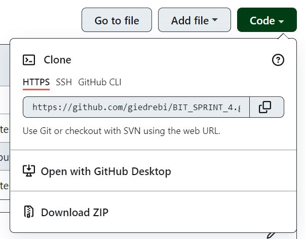

# BIT_SPRINT_4

Project was created for learning purposes. It's a SHOPPING List app.

Project's url: [SHOPPING List app](https://giedrebi.github.io/BIT_SPRINT_4/)

### About project

* Website include 5 functions:
  - Add item
  - Edit item
  - Save edited item
  - Remove item
  - Remove all list

* Made with HTML, CSS and Javascript.

### How to instal
1. First you need to clone repository. Copy link of repository here:

2. Go to the folder where you want clone repository, then open GIT BASH there. 

3. Type `git clone`, then paste the URL you copied earlier and press Enter to create your local clone:

`$ git clone https://github.com/giedrebi/BIT_SPRINT_4.git` 

5. You need to have **Live Server** extension in VScode.

6. Open cloned project folder in VScode. 

7. To see website, press on `Go Live` in the below line:

### Author

This project was created by me [Giedre Bielske](https://giedrebi.github.io/)

As well, you can find me in [LinkedIn](https://www.linkedin.com/in/giedr%C4%97-bielsk%C4%97-1a8996107/)
